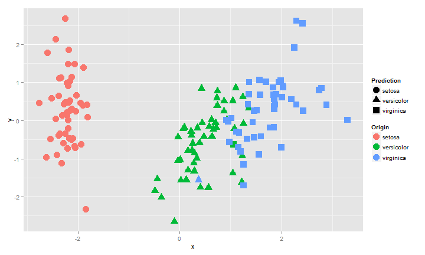

## Outline
This slide shows how to build a predicative model using iris Data.

1. Divide the iris data into training and testing data.
2. Build a model using randomForest package
3. Plot 

--- .class #id 

## Building The model

```r
require(randomForest)
```

```
## Loading required package: randomForest
## randomForest 4.6-7
## Type rfNews() to see new features/changes/bug fixes.
```

```r
N = nrow(iris)
training_index = sample(1:N,0.6*N,replace = F)
training = iris[training_index, ]
testing = iris[-training_index, ]
mymodel = randomForest(Species~.,data = training)
```


--- .class #
## Results

```r
pred = predict(mymodel,newdata = testing[,-5])
table(pred,testing[,5])
```

```
##             
## pred         setosa versicolor virginica
##   setosa         18          0         0
##   versicolor      0         20         1
##   virginica       0          1        20
```

--- .class #

## Generate Data for ploting

```r
mydata = cmdscale(dist( scale(iris[,-5]) ) )
Prediction = predict(mymodel,newdata = iris[,-5])
mydataframe = data.frame(x=mydata[,1],
                         y=mydata[,2],
                         Origin = iris$Species,
                         Prediction = Prediction)
```

--- .class #

## Plot

```
## Loading required package: ggplot2
```

 
